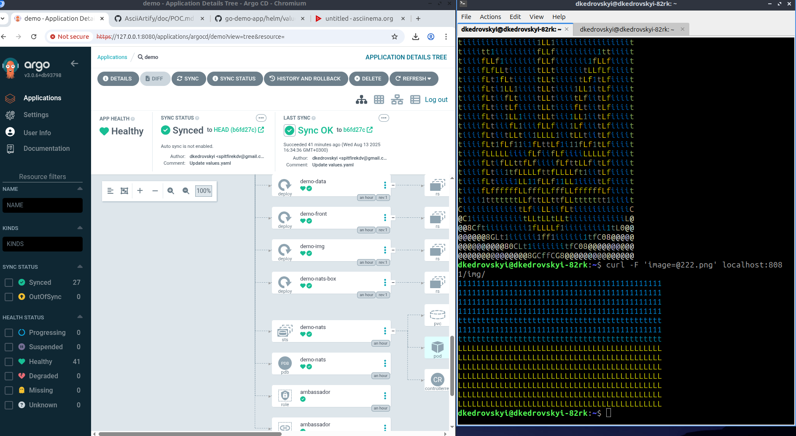

# Minimum Viable Product (MVP):

1. Checking AsciiArtify application
- Check all pods in demo namespace are alive
```bash
dkedrovskyi@dkedrovskyi-82rk:~$ kubectl get po -n demo 
NAME                                 READY   STATUS    RESTARTS   AGE
pod/ambassador-64d97bcfc9-w4jxd      1/1     Running   0          32m
pod/cache-7995dc47c8-jxk5m           1/1     Running   0          53m
pod/db-57657d957c-bn7wr              1/1     Running   0          53m
pod/demo-api-6cf9bb95-7ld2v          1/1     Running   0          53m
pod/demo-ascii-7446d8b8b9-9gsn8      1/1     Running   0          53m
pod/demo-data-64f785b878-b9tw4       1/1     Running   0          53m
pod/demo-front-64b97cc6cf-2rs8r      1/1     Running   0          53m
pod/demo-img-54868756dd-bkmp2        1/1     Running   0          53m
pod/demo-nats-0                      3/3     Running   0          32m
pod/demo-nats-box-58f884cff9-7wq7h   1/1     Running   0          53m
```
- Forwarding ports:
```bash
$ kubectl port-forward -n demo svc/ambassador 8081:80&
Forwarding from 127.0.0.1:8081 -> 80
Forwarding from [::1]:8081 -> 80
```
- Checking app response:  
```bash
$ curl localhost:8081
k8sdiy-api:599e1af#       
```

- Upload images:
```bash
curl -F 'image=@111.png' localhost:8081/img/
curl -F 'image=@222.png' localhost:8081/img/
```
- : Result 

  

2. Short record:

[](https://asciinema.org/a/0EW8U2Pvwla5rmRP0vDXJSwh5)
